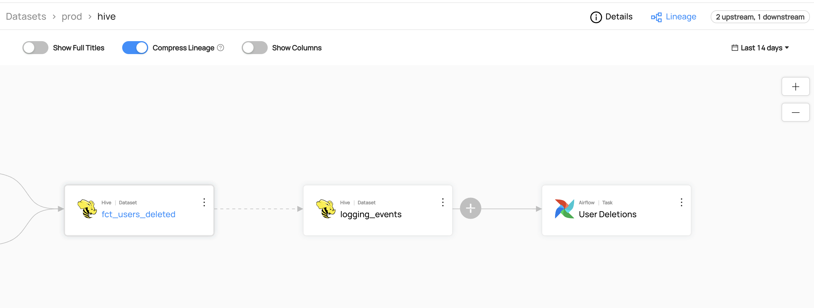

import Tabs from '@theme/Tabs';
import TabItem from '@theme/TabItem';

# Modifying Lineages

## Why Would You Use Lineage?

Lineage is used to capture data dependencies within an organization. It allows you to track the inputs from which a data asset is derived, along with the data assets that depend on it downstream.
For more information about lineage, refer to [About DataHub Lineage](/docs/lineage/lineage-feature-guide.md).

### Goal Of This Guide

This guide will show you how to 
* Add: add lineage between two hive datasets named `fct_users_deleted` and `logging_events`.

## Prerequisites

For this tutorial, you need to deploy DataHub Quickstart and ingest sample data.
For detailed steps, please refer to [Datahub Quickstart Guide](/docs/quickstart.md).

:::note
Before adding lineage, you need to ensure the targeted dataset is already present in your datahub.
If you attempt to manipulate entities that do not exist, your operation will fail.
In this guide, we will be using data from sample ingestion.
:::

## Add Lineage 


<Tabs>
<TabItem value="graphql" label="GraphQL" default>
avigate to GraphQL Explorer (`http://localhost:9002/api/graphiql`) and run the following query.

```json
mutation updateLineage {
  updateLineage(
    input: {
      edgesToAdd: [
        {
          downstreamUrn: "urn:li:dataset:(urn:li:dataPlatform:hive,logging_events,PROD)"
          upstreamUrn: "urn:li:dataset:(urn:li:dataPlatform:hive,fct_users_deleted,PROD)"
        }
      ]
      edgesToRemove: []
    }
  )
}
```

Note that you can create a list of edges. For example, if you want to assign multiple upstream entities to a downstream entity, you can do the following.

```json
mutation updateLineage {
  updateLineage(
    input: {
      edgesToAdd: [
        {
          downstreamUrn: "urn:li:dataset:(urn:li:dataPlatform:hive,logging_events,PROD)"
          upstreamUrn: "urn:li:dataset:(urn:li:dataPlatform:hive,fct_users_deleted,PROD)"
        }
        {
          downstreamUrn: "urn:li:dataset:(urn:li:dataPlatform:hive,logging_events,PROD)"
          upstreamUrn: "urn:li:dataset:(urn:li:dataPlatform:hive,fct_users_created,PROD)"
        }
      ]
      edgesToRemove: []
    }
  )
}

```

For more information about the `updateLineage` mutation, please refer to [updateLineage](https://datahubproject.io/docs/graphql/mutations/#updatelineage).

If you see the following response, the operation was successful:

```python
{
  "data": {
    "updateLineage": true
  },
  "extensions": {}
}
```
</TabItem>
<TabItem value="curl" label="Curl">

```shell
curl --location --request POST 'http://localhost:8080/api/graphql' \
--header 'Authorization: Bearer <my-access-token>' \
--header 'Content-Type: application/json'  --data-raw '{ "query": "mutation updateLineage { updateLineage( input:{ edgesToAdd : { downstreamUrn: \"urn:li:dataset:(urn:li:dataPlatform:hive,fct_users_deleted,PROD)\", upstreamUrn : \"urn:li:dataset:(urn:li:dataPlatform:hive,logging_events,PROD)\"}, edgesToRemove :{downstreamUrn: \"urn:li:dataset:(urn:li:dataPlatform:hive,fct_users_deleted,PROD)\",upstreamUrn : \"urn:li:dataset:(urn:li:dataPlatform:hive,fct_users_deleted,PROD)\" } })}", "variables":{}}'
```

Expected Response:

```json
{ "data": { "updateLineage": true }, "extensions": {} }
```
</TabItem>
<TabItem value="python" label="Python">

```python
{{ inline /metadata-ingestion/examples/library/lineage_emitter_rest.py show_path_as_comment }}
```

</TabItem>
</Tabs>


### Expected Outcomes of Adding Lineage

You can now see the lineage between `fct_users_deleted` and `logging_events`.


