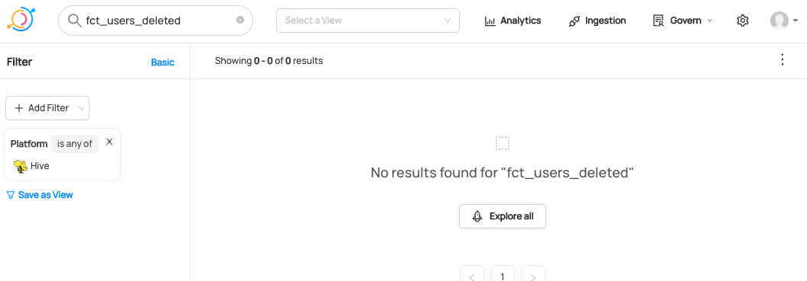

import Tabs from '@theme/Tabs';
import TabItem from '@theme/TabItem';

# Modifying Dataset

## Why Would You Use Datasets?

The dataset entity is one the most important entities in the metadata model. They represent collections of data that are typically represented as Tables or Views in a database (e.g. BigQuery, Snowflake, Redshift etc.), Streams in a stream-processing environment (Kafka, Pulsar etc.), bundles of data found as Files or Folders in data lake systems (S3, ADLS, etc.).
For more information about datasets, refer to [Dataset](/docs/generated/metamodel/entities/dataset.md).

### Goal Of This Guide

This guide will show you how to 
* Create: create a dataset named `realestate_db.sales` with three columns.
* Delete: delete a dataset named `fct_user_deleted`.

## Prerequisites

For this tutorial, you need to deploy DataHub Quickstart and ingest sample data.
For detailed steps, please refer to [Datahub Quickstart Guide](/docs/quickstart.md).

<Tabs>
<TabItem value="graphql" label="GraphQL">

> 🚫 Creating a dataset via `graphql` is currently not supported.
> Please check out [API feature comparison table](/docs/api/datahub-apis.md#datahub-api-comparison) for more information,

</TabItem>
<TabItem value="python" label="Python" default>

```python
{{ inline /metadata-ingestion/examples/library/dataset_schema.py show_path_as_comment }}
```
</TabItem>
</Tabs>


### Expected Outcomes of Creating Dataset

You can now see `realestate_db.sales` dataset has been created.


## Delete Dataset

You may want to delete a dataset if it is no longer needed, contains incorrect or sensitive information, or if it was created for testing purposes and is no longer necessary in production.
It is possible to [delete entities via CLI](/docs/how/delete-metadata.md), but a programmatic approach is necessary for scalability.

There are two methods of deletion: soft delete and hard delete.
**Soft delete** sets the Status aspect of the entity to Removed, which hides the entity and all its aspects from being returned by the UI.
**Hard delete** physically deletes all rows for all aspects of the entity.

For more information about soft delete and hard delete, please refer to [Removing Metadata from DataHub](/docs/how/delete-metadata.md#delete-by-urn).


<Tabs>
<TabItem value="graphql" label="GraphQL">

> 🚫 Hard delete with `graphql` is currently not supported.
> Please check out [API feature comparison table](/docs/api/datahub-apis.md#datahub-api-comparison) for more information.

```json
mutation batchUpdateSoftDeleted {
    batchUpdateSoftDeleted(input:
      { urns: ["urn:li:dataset:(urn:li:dataPlatform:hive,fct_users_deleted,PROD)"],
        deleted: true })
}
```

If you see the following response, the operation was successful:

```json
{
  "data": {
    "batchUpdateSoftDeleted": true
  },
  "extensions": {}
}
```

</TabItem>
<TabItem value="curl" label="Curl">

```shell
curl --location --request POST 'http://localhost:8080/api/graphql' \
--header 'Authorization: Bearer <my-access-token>' \
--header 'Content-Type: application/json' \
--data-raw '{ "query": "mutation batchUpdateSoftDeleted { batchUpdateSoftDeleted(input: { deleted: true, urns: [\"urn:li:dataset:(urn:li:dataPlatform:hive,fct_users_deleted,PROD)\"] }) }", "variables":{}}'
```

Expected Response:

```json
{ "data": { "batchUpdateSoftDeleted": true }, "extensions": {} }
```

</TabItem>
<TabItem value="python" label="Python" default>

```python
{{ inline /metadata-ingestion/examples/library/delete_dataset.py show_path_as_comment }}
```
</TabItem>
</Tabs>

### Expected Outcomes of Deleting Dataset

The dataset `fct_users_deleted` has now been deleted, so if you search for a hive dataset named `fct_users_delete`, you will no longer be able to see it.


